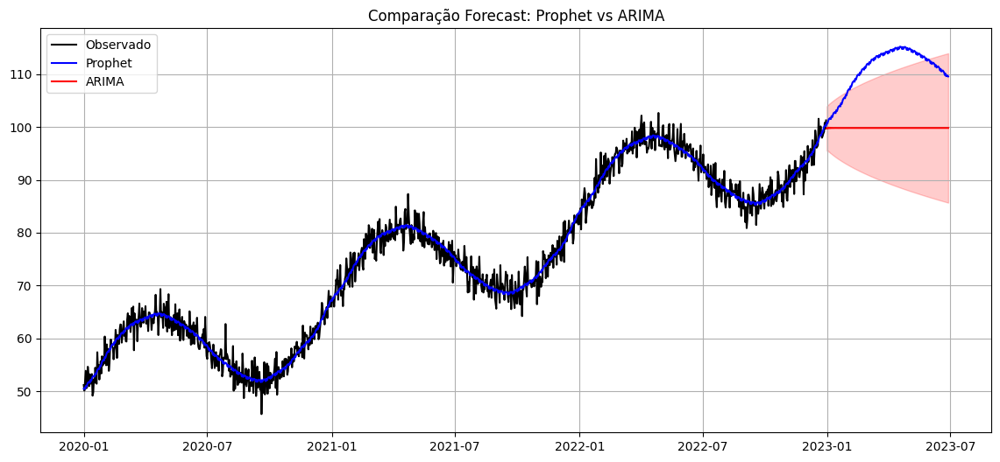

# Prophet_vs_ARIMA_TimesSeries
Comparação de uma série temporal simulada com alta sazonalidade com modelos Prophet e ARIMA.

### Google Colab: 
https://colab.research.google.com/drive/1DXNiukEIeaV4EF993ddqNLQC_fnOtyDd#scrollTo=ZclZf_4uJa2o

## ✨ Funcionalidades

- Geração de Dados simulados.
- Modelagem preditiva com Prophet.
- Modelagem preditiva com ARIMA.
- Realizando previsões futuras.
- Comparação visual dos resultados

## 🛠 Tecnologias Utilizadas

- Python 3.x
- StatsModels: model ARIMA
- Prophet: prophet

## 🤝 Resultados


## 💻 Como Executar

```bash
# Clonar o repositório
git clone https://github.com/jaquelinesfernandes/Prophet_vs_ARIMA_TimesSeries
cd Prophet_vs_ARIMA_TimesSeries

